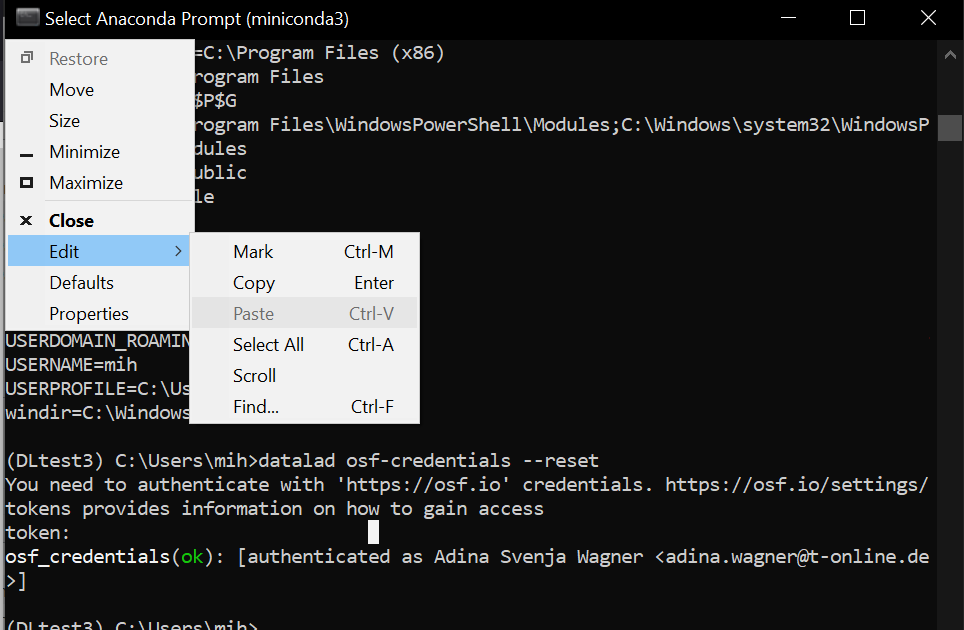

.. index::
   single: Windows; password, copy-paste

KBI0031: Copy-Pasting on Windows
================================

:authors: Adina Wagner <adina.wagner@t-online.de>
:discussion: <link>
:keywords: Windows, authentication failure, password, copy-paste
:software-versions: windows_10

On Windows systems, DataLad operations may be performed in the Anaconda Prompt, a shell that gets installed together with the `Anaconda <https://www.anaconda.com/download/>`_ or `Miniconda <https://docs.conda.io/projects/miniconda/en/latest/>`_ Python distributions.
While generally usable, the Anaconda Prompt (and other shells on Windows) can have quirks that make DataLad operations more cumbersome.
One is potentially inconsistent behavior between copy-pasting with the ``CTRL-C`` ``CTRL-V`` key combination and the "Paste" button hidden in the upper left corner's drop menu under "Edit".

Although we haven't found an explanation for this behavior, we have in several instances observed that hidden password entry via ``CTRL-C`` ``CTRL-V`` fails, inserting an additional special character and thus preventing successful authentication.
One example is `this issue <https://github.com/datalad/datalad-osf/issues/182>`_.

If you encounter authentication failures on Windows after you pasted a password you know should be correct, it is worthwhile to retry using the drop down menu shown in the screenshot above.